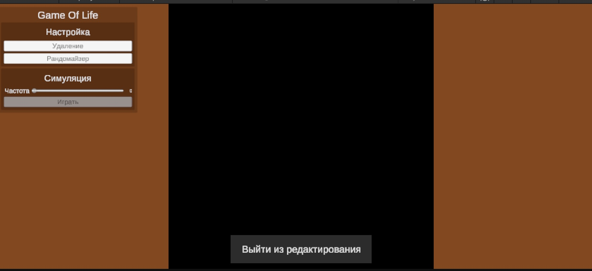

# Мой проект Game of Life



## Описание
Это моя реализация игры "Жизнь" на Unity.

### Режим ручного редактирования
Специальный режим, позволяющий вручную создавать и редактировать паттерны клеток на игровом поле.


#### Как работает:
- **Активация**: Нажатие кнопки "Ручная генерация"
- **Редактирование**: Клик ЛКМ по клеткам для переключения состояния
- **Визуальная обратная связь**: 
  - Живые клетки - зеленые
  - Мертвые клетки - черные
- **Блокировка управления**: В режиме редактирования остальные элементы управления временно отключаются

#### Скриншоты для демонстрации:

**1. Режим редактирования - активация**
- Кнопка "Ручная генерация" в неактивном состоянии
- Все элементы управления доступны

**2. Режим редактирования - активен** 
- Кнопка изменилась на "Выйти из редактирования"
- Dropdown выбора режима и слайдер скорости стали неактивными (серые)
- Сообщение в консоли: "Режим редактирования: ВКЛЮЧЕН - кликайте по клеткам!"

**3. Процесс редактирования**
- Курсор мыши над клеткой
- Демонстрация кликов по клеткам с изменением цвета
- Показать созданный пользовательский паттерн

### Произвольная (случайная) генерация
Функция для автоматического создания случайных конфигураций клеток.


**4. Случайная генерация**
- Показать несколько разных случайных конфигураций
- Демонстрация эволюции сгенерированных паттернов

##  Что такое Tick в проекте

### Определение
**Tick** (тактовый цикл) - это интервал времени в секундах между обновлениями игрового состояния. 

### Цифры на слайдере - что они означают:

**Значение 0.1** 
- Обновление каждые 0.1 секунды
- 10 обновлений в секунду
- Очень быстрая симуляция
- Подходит для быстрого просмотра эволюции

**Значение 0.5**
- Обновление каждые 0.5 секунды  
- 2 обновления в секунду
- Стандартная скорость наблюдения
- Удобно для отслеживания изменений

**Значение 1.0**
- Обновление каждую 1 секунду
- 1 обновление в секунду
- Медленная скорость
- Подходит для изучения сложных паттернов

**Значение 2.0**
- Обновление каждые 2 секунды
- 0.5 обновлений в секунду
- Очень медленная симуляция
- Для детального анализа каждого шага

### Как это работает технически:
```csharp
// Каждый кадр проверяем:
if (timer >= simulateCellsConfig.TickDuration)
{
    // Выполняем один шаг игры
    ApplyGameRules();
    timer = 0f; // Сбрасываем счетчик
}
